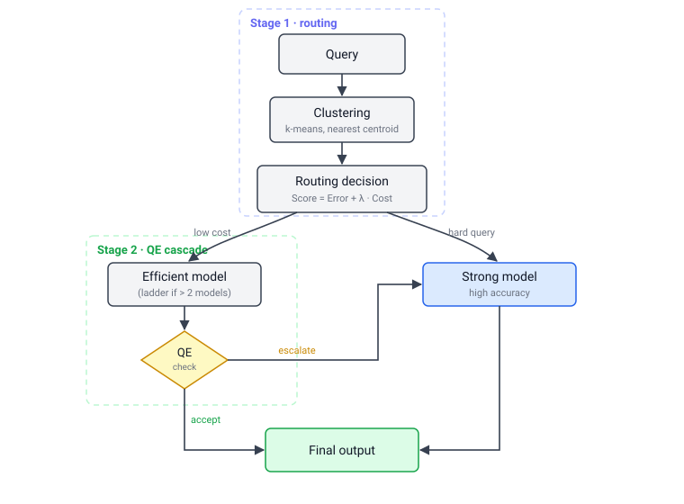

# CRE-Router

[](https://github.com/ymoslem/CRE-Router/actions/workflows/tests.yml)

Implementation of the paper, [**Cluster, Route, Escalate: Cascaded Framework for Cost-Aware LLM Serving**](https://arxiv.org/abs/2606.27457).


## System overview

Production deployment of large language models forces a trade-off between
accuracy and cost. CRE-Router framework routes each query to the most
cost-effective model in a pool, then escalates low-quality outputs to a
stronger model:

- **Stage 1 (clustering-based routing).** Queries are embedded and
  clustered offline; each cluster is assigned to the model minimizing
  `Error(m, c) + lambda * Cost_norm(m)`, where `lambda` ($\lambda$, the cost weight) is
  tuned once to `lambda*` ($\lambda^*$) to satisfy a Time Per Output Token (TPOT) budget.
- **Stage 2 (quality-estimation cascade).** A lightweight classifier
  inspects each efficient-model output and escalates low-quality answers to
  a stronger model. With more than two models, escalation follows an ordered
  ladder (weakest to strongest, following the $\lambda$ table): each model has
  its own classifier and the router rolls up to the next stronger model until
  an output is accepted or the top is reached.

Both stages train only on task-correctness labels obtainable from standard
benchmark evaluation; no extra annotation is required.

### Choosing the cost metric

Stage 1 scores each model with `Error(m, c) + lambda * Cost_norm(m)`. `Cost` is
either time per output token (`--cost-metric tpot`, the default, which reproduces
the published results) or end-to-end request latency (`--cost-metric e2el`).

The two agree while pool members emit similar numbers of tokens, and diverge as
soon as they do not. A reasoning model and a non-reasoning one can differ by less
than a millisecond in TPOT while differing several-fold in E2EL, because
`E2EL = TTFT + TPOT * L` and TPOT divides the output length `L` out. Use E2EL
whenever the pool mixes thinking and non-thinking members, or verbose and terse
ones.

<p align="center"></p>

## Pipeline

The full workflow is driven by the `cre` CLI, one stage per step:

`cre cluster` → `cre evaluate` → `cre fit` → `cre qe-train` → `cre qe-cascade` → `cre serve`

Serving (`cre serve`) switches between the live vLLM backends through [LiteLLM](https://github.com/BerriAI/litellm).

| Stage | What it does | Input | Output | Key options |
|---|---|---|---|---|
| `cre cluster` | Embeds training queries and fits k-means centroids (k chosen by Silhouette) | JSONL of training queries | `centroids.npy` and `router.json`; `train_assignments.jsonl` | `--k`, `--embedding-model` |
| `cre evaluate` | Runs each model per cluster through vLLM's benchmark, scores answers, averages per-cluster error and TPOT. This is the slowest stage; cost scales with model size, output length, and `--runs`, and it runs once per model. | dataset JSONL, a running vLLM server, fitted centroids | per-model entry in the stats JSON; raw runs under `results/` | `--runs`, `--port`, `--concurrency` |
| `cre fit` | Pareto-prunes the pool, sweeps $\lambda$, selects $\lambda^*$ under the cost budget | stats JSON, budget B | routing table and $\lambda^*$ in `router.json` | `--budget` (required), `--cost-metric`, `--output` |
| `cre qe-train` | Fine-tunes ModernBERT-base as the accept/escalate QE classifier | HF dataset of model outputs with correctness labels | QE classifier checkpoint | `--learning-rate`, `--max-length`, `--attn-implementation` |
| `cre qe-cascade` | Replays the trained QE over an efficient model's saved generations, composing per-cluster cascade accuracy and escalation counts | generations JSONL, the strong model's outcomes, a QE checkpoint | cascade config for `cre cascade` | `--clusters`, `--accept-threshold` |
| `cre cascade` | Composes Stage 1+2 system accuracy and latency, under TPOT and E2EL, from measured stats | cascade config | system accuracy, TPOT, E2EL | `--stats` |
| `cre serve` | Runs the live router: sends each incoming query to its cluster's assigned model, and escalates weak answers to a stronger model | serving config, running backends | live HTTP router on port 4000 | `--config`, `--port` |

Full flags for any stage: `cre <stage> --help`.

## Installation

```bash
pip install "cre-router[full]"
```

This is the whole pipeline on one machine: clustering and routing, the
cascade router, QE classifier training/evaluation, and vLLM for measurement
and for hosting backend models. If you want a narrower install, pick from the
extras below.

| Extra | Adds | For |
|---|---|---|
| (core) | numpy, scikit-learn, sentence-transformers, pyyaml, anyio | `cre cluster`, `cre fit` — always installed |
| `serve` | + litellm, fastapi, uvicorn, httpx, torch, transformers | `cre serve` — the Stage 1 + Stage 2 cascade router (loads ModernBERT in-process) |
| `qe` | + torch, transformers, datasets, accelerate | `cre qe-train`, `cre qe-eval` — train and evaluate the QE classifier |
| `eval` | + vllm | `cre evaluate` — per-cluster measurement; also provides `vllm serve` for backends |
| `full` | qe + serve + eval | the whole pipeline on one machine |

The vLLM backends the router talks to are separate processes started with
`vllm serve <model>` (cf.
[Quickstart: serve CRE-Router](#quickstart-serve-cre-router-gpu-required)); a
`serve`-only host still needs vLLM installed wherever those backends run.

Efficient QE training also needs [FlashAttention](https://github.com/Dao-AILab/flash-attention)
(`flash-attn`), installed as a second step once torch is already present
(e.g. after `pip install "cre-router[qe]"`):

```bash
pip install flash-attn --no-build-isolation
```

(the paper used `flash-attn==2.8.3`). The flag matters: without it, pip's
isolated build environment can't see your installed torch/CUDA, so the build
targets the wrong version. Without flash-attn at all, pass
`cre qe-train --attn-implementation sdpa` to fall back.

## Quickstart: routing table (no GPU)

A standalone, zero-setup demo of the routing math itself, no serving and no
GPU involved. Running it reproduces the paper's routing table and $\lambda^*$
selection directly from the checked-in stats, so you can see how Stage 1
decides which model handles which cluster before setting up any backends.
It is *not* a prerequisite for the end-to-end GPU-based serving,
which fits its own routing table as one of its steps (cf.
[Quickstart: serve CRE-Router](#quickstart-serve-cre-router-gpu-required)).
The per-cluster
stats measured in the paper are checked in under
[`configs/`](configs), so the routing table and budgeted $\lambda^*$ reproduce
without any GPU:

```bash
cre fit --stats configs/aime_stats.json --budget 20
```

This prints the Pareto analysis, the $\lambda$ sweep (routing regions), and the
$\lambda^*$ selection. To regenerate the stats from scratch (clustering plus
per-model measurement on a GPU), run `cre cluster` and `cre evaluate` on your
own dataset and models, the same commands used for the paper (see the
[Pipeline](#pipeline) table above). If you want to reproduce the paper's exact
numbers with its datasets and models, see [REPRODUCE.md](REPRODUCE.md) instead.

## Quickstart: serve CRE-Router (GPU required)

This walks through standing up the live router end to end, using the paper's
AIME pool as a concrete, runnable example. Swap in your own models, dataset,
and config the same way once you see the shape of it.

1. Start one vLLM server per pool model. `--max-model-len` must cover input +
   the task's generation length (40,960 for AIME), or long outputs truncate:

   ```bash
   vllm serve WeiboAI/VibeThinker-1.5B --port 8001 --max-model-len 42000
   vllm serve Qwen/Qwen3-30B-A3B-Thinking-2507-FP8 --port 8002 --max-model-len 42000
   ```

2. Fit centroids and write the routing table into an artifacts directory.
   Reusing the checked-in stats skips the GPU measurement step:

   ```bash
   python data/download.py --dataset ymoslem/AIME-clustered --split train --output data/aime_train.jsonl
   cre cluster --input data/aime_train.jsonl --embeddings-field embeddings --output artifacts/aime
   cre fit --stats configs/aime_stats.json --budget 20 --output artifacts/aime
   ```

3. Write a serving config. It carries only deployment wiring — the model pool
   (each model's endpoint) and the QE classifier checkpoints. The routing
   table, $\lambda^*$, and the escalation ladder are read from the artifacts and
   the arithmetic, never set by hand. Point
   [`example_config_aime24.yaml`](src/cre_router/server/example_config_aime24.yaml)
   at your backends and serve (a TeleQnA config,
   [`example_config_teleqna.yaml`](src/cre_router/server/example_config_teleqna.yaml),
   is also provided):

   ```bash
   cre serve --config example_config_aime24.yaml
   ```

4. Send a standard chat-completions request:

   ```bash
   curl http://localhost:4000/v1/chat/completions \
     -H "Content-Type: application/json" \
     -d '{"messages": [{"role": "user", "content": "..."}]}'
   ```

   Routing decisions are returned as `x-cre-cluster`, `x-cre-stage1-model`,
   `x-cre-final-model`, `x-cre-escalated`, and `x-cre-path` response headers.
   Streaming is not supported: Stage 2 must inspect the complete response before
   deciding whether to escalate it.

5. Monitor the deployment. `GET /stats` returns live tallies (total requests,
   escalation rate, and counts per cluster, per final model, and per
   escalation path). Setting `decision_log: <path>` in the config also appends
   one JSON record per request to that file. Both are designed to add no
   latency to requests: `/stats` is in-memory counters, and the decision log
   is written by a background task fed through a non-blocking queue.

## Supported models and datasets

**Models.** Any model you can serve behind a chat-completions HTTP endpoint
(the paper uses vLLM). The pool is arbitrary and can mix sizes and families;
routing, Pareto pruning, and the escalation ladder adapt to whatever pool you
measure. The paper's pools are Qwen 3 / Qwen 3.5, Gemma 4, and VibeThinker
(see [REPRODUCE.md](REPRODUCE.md)).

**Datasets.** `cre evaluate` ships tasks for three benchmarks: `aime` and
`telemath` (numeric answers) and `teleqna` (multiple choice), each defining an
answer parser and sampling preset. A benchmark may also ship variants for a
model's thinking and non-thinking modes, differing in sampling and in whether the
prompt is pre-rendered. A new dataset with a different answer format needs one new
`Task` entry (a parser + sampling) in [evaluate.py](src/cre_router/evaluate.py);
clustering, routing, and the QE cascade are domain-agnostic and need no
changes.

## Data formats

Inputs are JSONL, one object per line. Cluster ids are strings ("0", "1", ...)
throughout.

- **Training queries** (`cre cluster`): `prompt` (text to embed). Any other
  fields are ignored.
- **Evaluation dataset** (`cre evaluate`): `prompt` (sent to the model),
  `answer` (ground truth), and optionally `cluster`. Without `cluster`, pass
  `--artifacts` and each row is assigned to its nearest fitted centroid.
- **QE dataset** (`cre qe-train`, `cre qe-eval`): `question`, `full_output`
  (the model's completion), `num_tokens` (output length), and `decision_label`
  (1 = accept, 0/2 = escalate). Matches the released `ymoslem/*-router` datasets.
- **Model stats** (`cre fit`): JSON with `cluster_sizes` and per-model `errors`
  and `cluster_tpot_ms`; see [`configs/aime_stats.json`](configs/aime_stats.json).
  Fitting with `--cost-metric e2el` also needs `cluster_e2el_ms`, and `cre cascade`
  additionally needs `cluster_output_tokens` to charge a discarded efficient pass
  against the delivered answer; see
  [`configs/aime_cascade_test.json`](configs/aime_cascade_test.json).
- **Serving config** (`cre serve`): YAML; see
  [`example_config_aime24.yaml`](src/cre_router/server/example_config_aime24.yaml).

An artifacts directory (written by `cre cluster` / `cre fit`) holds
`centroids.npy`, `router.json`, and `train_assignments.jsonl`. `router.json`
carries the embedding model, the routing table, $\lambda^*$, the budget, the cost
metric it was fitted under, and the pool stats. `cre serve` reads the last two
back to derive the escalation ladder under the same metric that produced the
table.

## Repository layout

```
cre-router/
├── src/cre_router/
│   ├── clustering.py            Stage 1: embed queries, fit k-means centroids
│   ├── routing.py               Stage 1: cost-aware routing, Pareto, lambda*
│   ├── evaluate.py              Stage 1: measure per-cluster accuracy and TPOT via vLLM
│   ├── artifacts.py             load/save centroids + routing table
│   ├── cli.py                   the `cre` entry point
│   ├── qe/                      Stage 2: QE classifier
│   │   ├── train.py             fine-tune the accept/escalate classifier
│   │   ├── classifier.py        inference wrapper used by the router
│   │   ├── cascade.py           replay the QE over saved generations (`cre qe-cascade`)
│   │   └── evaluate.py          standalone QE metrics (`cre qe-eval`)
│   └── server/                  live cascade router
│       ├── cascade_router.py    Stage 1 routing + Stage 2 escalation ladder
│       ├── app.py               HTTP endpoint, /stats, decision log
│       ├── example_config_aime24.yaml    serving config (AIME)
│       └── example_config_teleqna.yaml   serving config (TeleQnA)
├── configs/                     checked-in per-model stats for `cre fit`
├── data/
│   ├── download.py              fetch released datasets from the Hugging Face Hub
│   ├── prep_qe.py               build QE train/test splits from generation logs
│   ├── prep_telemath.py         fetch and split TeleMath
│   └── prep_gemma4_thinking.py  pre-render Gemma 4 prompts with thinking enabled
├── img/system.svg               architecture figure
├── tests/                       unit tests (routing math vs paper, cascade, ...)
├── requirements-paper.txt       frozen environment behind the paper's numbers
├── REPRODUCE.md                 reproducing the paper
├── DEVELOP.md                   local development and running the tests
└── README.md
```

## Citation

```bibtex
@article{moslem2026clusterrouteescalate,
      title={Cluster, Route, Escalate: Cascaded Framework for Cost-Aware LLM Serving}, 
      author={Yasmin Moslem and Magdalena Kacmajor and Vasudevan Nedumpozhimana and Ammar Abbas and Solmaz Panahi and David Lynch and Zhuangzhuang Nie and Alexandros Agapitos and Aleksandar Milenovic and Hongmeng Song and Yucheng Shi and Yue Pan and Patricia Buffini and John D. Kelleher},
      year={2026},
      eprint={2606.27457},
      archivePrefix={arXiv},
      primaryClass={cs.PF},
      url={https://arxiv.org/abs/2606.27457}, 
}
```

## Development

For local setup and running the test suite, see [DEVELOP.md](DEVELOP.md).

## License

Apache-2.0. See [LICENSE](LICENSE).
