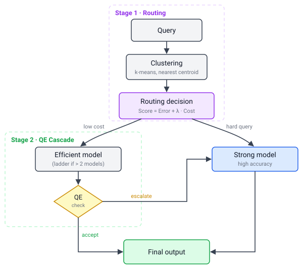

# Reproducing the paper

This document regenerates every routing and every Stage 1 + 2 number the paper
reports, from the released data and the `cre` commands, and lists the released artifacts, the pinned
environment and the citation. For the tool itself (install, CLI, serving) see
the [README](README.md).

## System design

The framework is a two-stage cascade. **Stage 1 (clustering-based routing)**
embeds each query, assigns it to a semantic cluster, and routes the cluster to
the model that minimizes a cost-adjusted score `Error + lambda * Cost` under a
latency budget, measured per output token (TPOT) or per request (E2EL); this
produces the routing table and the budgeted $\lambda^*$. **Stage 2
(quality-estimation cascade)** inspects an efficient model's output with a
lightweight ModernBERT classifier and escalates low-quality answers to a
stronger model.

<p align="center"></p>

The stages map onto the `cre` commands:

- **Stage 1.** Cluster the training queries (`cre cluster`), measure each
  model per cluster (`cre evaluate`), then fit the routing table and
  $\lambda^*$ (`cre fit`).
- **Stage 2.** Train and evaluate the accept/escalate classifier
  (`cre qe-train`, `cre qe-eval`).
- **Both stages, measured.** `cre stats` rebuilds the per-cluster statistics
  from saved captures, and `cre compose` prices a routing, with its
  escalations, on the batches that were actually served.
- **Both stages, deployed.** `cre serve`.

## Installation (from source)

Everything below runs from a checkout. The configs this document reads live in
the repository and in the source distribution, not in the wheel.

```bash
git clone https://github.com/ymoslem/CRE-Router.git
cd CRE-Router
pip install -e ".[data]"
```

The `data` extra reads the released datasets and is all the no-GPU sections
need. Add `qe` to train classifiers, `eval` (which pulls vLLM) to measure
models, and `serve` to deploy; `full` installs all four. To pin the exact
environment behind the reported numbers see [Pinned environment](#pinned-environment).

## Reproducing the reported numbers (no GPU)

Every model answer the paper scores was saved as it was served, with its
output, its grade and its latency, and is released as
[`ymoslem/cluster-route-escalate-captures`](https://huggingface.co/datasets/ymoslem/cluster-route-escalate-captures)
(about 5 GB). The Stage 2 classifiers' accept probabilities on those answers are released as
[`ymoslem/cluster-route-escalate-scores`](https://huggingface.co/datasets/ymoslem/cluster-route-escalate-scores).
From these two datasets the whole pipeline reruns without a GPU, with no model
served and no classifier loaded.

```bash
hf download ymoslem/cluster-route-escalate-captures --repo-type dataset --local-dir hub/captures
hf download ymoslem/cluster-route-escalate-scores --repo-type dataset --local-dir hub/scores
```

Answers are graded again from the full output by each benchmark's own grader
whenever they are read, never taken from a stored verdict, and each request is
joined to its question by output length, so a capture that does not match its
records is refused rather than composed.

### 1. Per-cluster statistics

A pool spec in [`configs/pools/`](configs/pools) names the capture behind each
model. `cre stats` averages each (cluster, run) batch the way `cre evaluate`
does and writes the file `cre fit` reads:

```bash
mkdir -p stats
for pool in aime_1xA100 aime_2xA100 teleqna_1xA100 teleqna_2xA100 telemath_1xA100 telemath_2xA100; do
  bench=${pool%%_*}; basis=${pool#*_}
  cre stats --pool configs/pools/${pool}_Sep2026.json --dataset hub/captures \
      --out stats/${bench}_stats_${basis}_Sep2026.json
done
```

The six files are byte-identical to the ones shipped in [`configs/`](configs),
which is how to check the step, and why the shipped files can stand in for it:

```bash
for f in stats/*.json; do cmp "$f" "configs/$(basename "$f")" && echo "identical: $f"; done
```

### 2. Stage 1: routing tables and $\lambda^*$

```bash
cre fit --stats stats/aime_stats_1xA100_Sep2026.json --budget 30
cre fit --stats stats/teleqna_stats_1xA100_Sep2026.json --budget 20
cre fit --stats stats/telemath_stats_1xA100_Sep2026.json --budget 20
cre fit --stats stats/telemath_stats_1xA100_Sep2026.json --budget 25
cre fit --stats stats/telemath_stats_1xA100_Sep2026.json --budget 25000 --cost-metric e2el
```

Each prints the Pareto analysis, the full $\lambda$ sweep (routing regions) and
the budget-feasible $\lambda^*$. The budget is in the units of the cost term,
milliseconds per token for TPOT (the default) and milliseconds per request for
E2EL. Clusters are written C0, C1, and so on; accuracy is on the training
split.

| benchmark, basis | budget | C0 | C1 | C2 | C3 | train accuracy |
| --- | --- | --- | --- | --- | --- | --- |
| AIME, 1 x A100 | TPOT 30 ms | Qwen3-30B | VibeThinker-1.5B | Qwen3-30B | | 91.3% at 27.3 ms |
| AIME, 2 x A100 | TPOT 20 ms | Qwen3-30B | VibeThinker-1.5B | Qwen3-30B | | 91.8% at 17.4 ms |
| TeleQnA, 1 x A100 | TPOT 20 ms | Gemma4-E4B | Gemma4-26B | | | 72.2% at 19.4 ms |
| TeleQnA, 2 x A100 | TPOT 15 ms | Qwen3-4B | Gemma4-26B | | | 71.9% at 13.4 ms |
| TeleMath, 1 x A100 | TPOT 20 ms | Qwen3-30B-think | Gemma4-E2B | Qwen3-30B-think | Gemma4-E4B-think | 64.7% at 17.5 ms |
| TeleMath, 1 x A100 | TPOT 25 ms | Qwen3-30B-think | Gemma4-E2B | Qwen3-30B-think | Gemma4-26B-think | 69.1% at 20.9 ms |
| TeleMath, 1 x A100 | E2EL 25 s | Gemma4-26B | Gemma4-E2B | Gemma4-26B | Gemma4-26B | 65.0% at 23.5 s |
| TeleMath, 2 x A100 | TPOT 20 ms | Qwen3-30B-think | Qwen3-30B-think | Gemma4-26B-think | Gemma4-26B-think | 74.0% at 17.3 ms |
| TeleMath, 2 x A100 | E2EL 25 s | Gemma4-26B | Gemma4-26B | Gemma4-26B | Gemma4-26B | 66.0% at 18.8 s |

The two-card rows come from the same commands on the `2xA100` files. Each card
count is fitted on its own costs, because a budget priced on one card is not
the same budget on two. At the one-card budgets the two-card pool stops being
constrained: 30 ms buys Qwen3-30B for every AIME cluster and 20 ms buys
Gemma4-26B for both TeleQnA clusters, so the two-card AIME and TeleQnA systems
are fitted at 20 ms and 15 ms. On TeleMath the TPOT budget of 20 ms already
buys the most accurate routing on two cards, and E2EL at 25 s selects
Gemma4-26B everywhere, so that system has no Stage 2 on two cards.

What each pool prunes also depends on the hardware. On one card nothing in the
TeleQnA pool is Pareto-dominated and the sweep has six regions; on two cards
Gemma4-E2B is dominated. In the TeleMath pool Gemma4-26B (non-thinking) is
dominated under TPOT on one card. The routings are checked by tests in
[`tests/test_routing.py`](tests/test_routing.py).

**Cost can be conditioned on the cluster.** By default each model is priced by
one cost for the whole pool (`--cost-conditioning model`).
`--cost-conditioning cluster` prices each (model, cluster) pair by its own
measurement instead. It can change a routing only when a model's cost ranks
differently from one cluster to another. On the AIME and TeleQnA pools both
rules return the same routing at the budgets above, and so does the TeleMath
pool on two cards and under E2EL. On TeleMath on one card it changes both TPOT
routings:

| budget | C0 | C1 | C2 | C3 | train accuracy |
| --- | --- | --- | --- | --- | --- |
| TPOT 20 ms | Qwen3-30B-think | Gemma4-E2B | Gemma4-26B | Qwen3-30B-think | 67.2% at 19.0 ms |
| TPOT 25 ms | Qwen3-30B-think | Gemma4-E2B | Gemma4-26B | Gemma4-26B-think | 69.1% at 20.7 ms |

```bash
cre fit --stats stats/telemath_stats_1xA100_Sep2026.json --budget 20 --cost-conditioning cluster
cre fit --stats stats/telemath_stats_1xA100_Sep2026.json --budget 25 --cost-conditioning cluster
```

### 3. Stage 1 + 2 on the test split

A routing spec in [`configs/routings/`](configs/routings) fixes a fitted
routing: the capture serving each tier on the test split, the clusters Stage 2
gates, the escalation batch each run served, and the threshold $\tau$ = 0.5. Its
`_probs` field names the accept probabilities it reads. `cre compose` prices
every request on the batch that actually served it, over all 5 x 5 pairings of
an efficient run with a strong run:

```bash
cre compose --routing configs/routings/telemath_tpot_b20ms_1xA100_Sep2026.json \
    --dataset hub/captures --probs hub/scores/data/telemath_qe.parquet \
    --probs-source telemath/qe_probs_v3.jsonl
```

An escalated request keeps the strong model's answer and pays for both passes.
Its E2EL is the sum of the two, since Stage 2 reads the complete efficient
answer before escalating; its TPOT is the two decodes over the strong model's
tokens, following vLLM's per-request mean TPOT. Every escalation batch must
hold exactly the questions the probabilities escalate in that run, or
`cre compose` refuses it.

| routing spec | Stage 1 accuracy / TPOT / E2EL | Stage 1 + 2 accuracy / TPOT / E2EL |
| --- | --- | --- |
| `aime_tpot_b30ms_1xA100` | 0.83778 / 19.545 ms / 348.82 s | 0.85067 / 20.108 ms / 362.71 s |
| `aime_tpot_b20ms_2xA100` | 0.84667 / 12.734 ms / 227.64 s | 0.86978 / 13.527 ms / 246.12 s |
| `teleqna_tpot_b20ms_1xA100` | 0.71740 / 17.599 ms / 0.79 s | 0.73716 / 20.819 ms / 0.97 s |
| `teleqna_tpot_b15ms_2xA100` | 0.71020 / 12.270 ms / 0.58 s | 0.74256 / 15.287 ms / 0.75 s |
| `telemath_tpot_b20ms_1xA100` | 0.58905 / 17.350 ms / 117.72 s | 0.64159 / 19.121 ms / 139.06 s |
| `telemath_tpot_b25ms_1xA100` | 0.64677 / 20.442 ms / 182.29 s | 0.67383 / 21.453 ms / 194.07 s |
| `telemath_e2el_b25s_1xA100` | 0.60000 / 19.349 ms / 25.85 s | 0.62289 / 21.694 ms / 28.23 s |
| `telemath_tpot_b20ms_2xA100` | 0.71940 / 16.665 ms / 173.31 s | 0.73294 / 18.990 ms / 232.41 s |

Each spec reads the probabilities its `_probs` field names, from the
benchmark's file in `hub/scores/data/` (`aime_qe`, `teleqna_qe` or
`telemath_qe`). With `--json` the result is machine-readable.

### 4. No-clustering ablation (k = 1)

The ablation asks what the clusters are worth. It fits the same pool with every
question in one cluster, so Stage 1 picks a single model, and Stage 2 gates
all of it:

| routing spec | Stage 1 model | Stage 1 + 2 accuracy / TPOT / E2EL |
| --- | --- | --- |
| `telemath_k1_tpot_b20ms_1xA100` | Qwen3-4B-Instruct | 0.60199 / 29.066 ms / 209.18 s |
| `telemath_k1_tpot_b25ms_1xA100` | Qwen3-30B-think | 0.67264 / 28.992 ms / 213.67 s |
| `telemath_k1_e2el_b25s_1xA100` | Gemma4-E2B | 0.61552 / 27.570 ms / 41.68 s |

At TPOT 25 ms the budget buys Qwen3-30B-think for every question, leaving
nothing cheaper to escalate from, so that spec gates nothing and needs no
`--probs`:

```bash
cre compose --routing configs/routings/telemath_k1_tpot_b25ms_1xA100_Sep2026.json --dataset hub/captures
```

### Configuration names

Cost is a property of the serving setup, so every config names the
configuration that produced it, and there is no basis-less default:

| config | basis |
| --- | --- |
| `*_1xA100_Sep2026.json` | 1 x A100 SXM 80 GB at concurrency 32, vLLM 0.19.0 |
| `*_2xA100_Sep2026.json` | 2 x A100 SXM 80 GB (tensor parallel 2) at concurrency 32, vLLM 0.19.0 |

The two Sep 2026 bases differ only in card count, so comparing them isolates
what the hardware does to a routing.

## Regenerating the data (GPU)

Everything above starts from released captures. This section produces them.

### Clustering

The released clustered datasets carry the paper's clustering in their
`cluster` column. To reproduce it, cluster the frozen embeddings they ship in
their `embeddings` column:

```bash
python data/download.py --dataset ymoslem/AIME-clustered --split train --output data/aime_train.jsonl
cre cluster --input data/aime_train.jsonl --embeddings-field embeddings --output artifacts/aime
```

Dropping `--embeddings-field` re-embeds with all-MiniLM-L6-v2. The paper's
embeddings were computed on Apple Silicon (MPS), and re-embedding on other
hardware can move a few questions between clusters. The training-split cluster
sizes are AIME 194 / 405 / 322, TeleQnA 5,211 / 3,789 and TeleMath
98 / 98 / 51 / 52.

### Preparing TeleMath

TeleMath ([`netop/TeleMath`](https://huggingface.co/datasets/netop/TeleMath)) is
a gated dataset of 500 telecom mathematics problems with numerical answers, and
it ships no train split. `data/prep_telemath.py` creates one, stratified by
category and pinned by seed; its defaults reproduce the paper's 299 / 201
train / test split exactly:

```bash
HF_TOKEN=<your token> python data/prep_telemath.py --out data/telemath
cre cluster --input data/telemath_train.jsonl --k 4 --output artifacts/telemath
```

The pool mixes thinking and non-thinking models, served under three tasks:

| task | models | `--max-model-len` |
| --- | --- | --- |
| `telemath` | Qwen3-30B-A3B-Thinking, Qwen3-4B-Thinking | 45000 |
| `telemath_nothink` | Gemma4-E2B, Gemma4-E4B, Gemma4-26B, Qwen3-4B-Instruct (thinking off) | 32768 |
| `telemath_gemma4` | Gemma4-E2B, Gemma4-E4B, Gemma4-26B (thinking on) | 45000 |

Gemma 4's thinking switch is a chat-template argument, so `telemath_gemma4`
serves prompts rendered in advance with it switched on, once per Gemma model and
split. The task passes them to the model verbatim:

```bash
python data/prep_gemma4_thinking.py --in data/telemath_train.jsonl \
    --out data/telemath_train_gemma --model google/gemma-4-26B-A4B-it
```

### Measuring each model

Serve each model with vLLM and measure it per cluster:

```bash
vllm serve Qwen/Qwen3-30B-A3B-Thinking-2507-FP8 --port 8000 --max-model-len 45000
cre evaluate --task telemath --model Qwen/Qwen3-30B-A3B-Thinking-2507-FP8 \
    --dataset data/telemath_train.jsonl --artifacts artifacts/telemath \
    --stats-out stats/telemath_stats.json --runs 5 --save-generations
```

`cre evaluate` runs vLLM's benchmark per cluster, averages over `--runs`, and
saves the raw per-(cluster, run) measurements under `results/` so every number
in the stats traces back to a benchmark run; `--save-generations` adds the full
answers the grader and the classifier read. Each task fixes its own sampling
settings, listed in `TASKS` in [`evaluate.py`](src/cre_router/evaluate.py).
`--max-model-len` must cover the input plus the generation cap, 40,960 tokens
for AIME and the thinking TeleMath tasks. `cre evaluate` keys each entry by the
served model ID, whereas the shipped configs use short names such as
`Gemma4-E2B`; the routing is the same.

### QE classifier (Stage 2)

Each classifier is trained on its efficient model's own graded answers, and
early-stops on test run 0:

```bash
cre qe-train --dataset ymoslem/AIME-24-25-26-router --output-dir qe-aime \
    --max-length 4096 --learning-rate 5e-5 --eval-run 0
cre qe-train --dataset ymoslem/TeleQnA-router-gemma4-e4b --output-dir qe-teleqna \
    --max-length 512 --learning-rate 2e-5 --eval-run 0
cre qe-train --dataset ymoslem/TeleMath-router --train-split train_e2b --eval-split test_e2b \
    --output-dir qe-telemath-e2b --max-length 4096 --learning-rate 2e-5 --eval-run 0
cre qe-eval --classifier qe-aime --dataset ymoslem/AIME-24-25-26-router \
    --split test_vibethinker --max-length 4096
```

`cre qe-eval` reports the accuracy, macro-F1, and escalation confusion counts
(true, unnecessary and missed escalations) used in the QE appendices.

For a pool other than the released ones, build the QE data from the efficient
model's generations and replay a trained classifier over the gated clusters:

```bash
python data/prep_qe.py --train <train_generations.jsonl> \
    --test <test_generations.jsonl> --out qe-data/<name>
cre qe-cascade --classifier <checkpoint> --generations <test_generations.jsonl> \
    --clusters 1,3 --strong-outcomes <strong_outcomes.jsonl> \
    --strong-model <name>
```

## Serving the paper's pools

Three ready-made serving configs are provided, all for 1 x A100:

- [`example_config_aime24.yaml`](src/cre_router/server/example_config_aime24.yaml),
  AIME at TPOT 30 ms, VibeThinker-1.5B escalating to Qwen3-30B-A3B;
- [`example_config_teleqna.yaml`](src/cre_router/server/example_config_teleqna.yaml),
  TeleQnA at TPOT 20 ms, Gemma4-E4B escalating to Gemma4-26B;
- [`example_config_telemath.yaml`](src/cre_router/server/example_config_telemath.yaml),
  TeleMath at E2EL 25 s, Gemma4-E2B escalating to Gemma4-26B.

Point each at your running vLLM servers, then `cre serve --config <file>`. The
TeleMath TPOT routings cannot be served yet: `cre serve` escalates along one
ladder ordered by cost, so Gemma4-E2B would escalate to Gemma4-E4B-think rather
than to Qwen3-30B, and it does not pass Gemma 4's thinking switch.

## Released artifacts

Everything is public on the Hugging Face Hub:
<https://huggingface.co/collections/ymoslem/routing>.

| purpose | HF Hub ID |
| --- | --- |
| Every served answer, graded, with its latency | `ymoslem/cluster-route-escalate-captures` |
| Stage 2 accept probabilities on those answers | `ymoslem/cluster-route-escalate-scores` |
| AIME clustered training questions (1983-2023) | `ymoslem/AIME-clustered` |
| AIME clustered test questions (2024-2026) | `ymoslem/AIME-24-25-26-clustered` |
| TeleQnA clustered questions (k = 2) | `ymoslem/TeleQnA-clustered-k2` |
| TeleMath train / test split | `ymoslem/TeleMath-processed` |
| AIME QE data | `ymoslem/AIME-24-25-26-router` |
| TeleQnA QE data | `ymoslem/TeleQnA-router-gemma4-e4b` |
| TeleMath QE data | `ymoslem/TeleMath-router` |
| AIME QE classifier | `ymoslem/ModernBERT-base-AIME-24-25-26-router-qe-binary-vibethinker1.5b-5runs_1eval-10ep-lr5e-05` |
| TeleQnA QE classifier | `ymoslem/ModernBERT-base-TeleQnA-router-qe-classifier-binary-10ep-lr2e-05-gemma4e4b-5runs_1eval` |
| TeleMath QE classifiers | `ymoslem/ModernBERT-base-TeleMath-router-qe-classifier-binary-10ep-lr2e-05-e2b-5runs`, `...-e4b-think-5runs` |

Fetch any split as JSONL with `python data/download.py --dataset <id>`.

## Pinned environment

Package versions are pinned in
[`requirements-paper.txt`](requirements-paper.txt); read its header first, since
it records provenance rather than something to install over a working
environment. The reported numbers were measured on 1 x A100 and 2 x A100 SXM
80 GB under vLLM 0.19.0 and Python 3.11 with 32 concurrent requests, over
5 runs. TPOT is specific to the hardware and the vLLM version and will shift on
other hardware (for example H100 with full W8A8 FP8 support) or newer
releases, which can also change the selected $\lambda^*$. Efficient ModernBERT
training additionally used `flash-attn==2.8.3`.

Install order matters for the Gemma models. Installing the pinned vLLM pulls
transformers 4.57.6, which does **not** recognize the `gemma4` architecture, so
upgrade with `pip install transformers==5.5.3` afterwards (it serves both the
Qwen and Gemma pools; vLLM's `transformers<5` pin is conservative).

## Citation

```bibtex
@article{moslem2026clusterrouteescalate,
      title={Cluster, Route, Escalate: Cascaded Framework for Cost-Aware LLM Serving}, 
      author={Yasmin Moslem and Magdalena Kacmajor and Vasudevan Nedumpozhimana and Ammar Abbas and Solmaz Panahi and David Lynch and Zhuangzhuang Nie and Alexandros Agapitos and Aleksandar Milenovic and Hongmeng Song and Yucheng Shi and Yue Pan and Patricia Buffini and John D. Kelleher},
      year={2026},
      eprint={2606.27457},
      archivePrefix={arXiv},
      primaryClass={cs.PF},
      url={https://arxiv.org/abs/2606.27457}, 
}
```

## Acknowledgements

This work is funded by ADAPT Centre, Trinity College Dublin, and Huawei Ireland.
